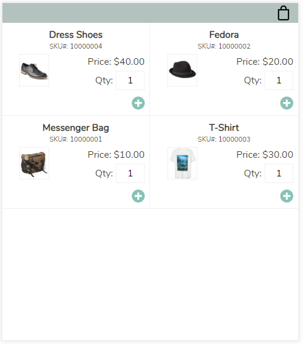

# Shopping Bag application using React and Redux
Shopping bag application written in [React](https://reactjs.org/) and [Redux](https://redux.js.org/) (for demonstration purpose only)

The application is located on [my portfolio site](http://www.dnwebfolio.com/index.php#spa).

Source codes are located in the **src/** directory:
* **src/ShoppingBagApp/** - Contains source files used to create Shopping Bag application
* **src/ShoppingBagApp/index.jsx** - Entry point of the application: Creates Redux store and mounts the application to DOM
* **src/ShoppingBagApp/actions** - Defines and creates Redux action types and action creators
* **src/ShoppingBagApp/assets** - Images and 'dummy' data files
* **src/ShoppingBagApp/components** - React components written in JSX that create the application
* **src/ShoppingBagApp/reducers** - Create Redux reducers
* **src/ShoppingBagApp/stylesheets/** - Sass stylesheet to style the application
* **src/ShoppingBagApp/utils/** - Utility JavaScript functions
* **src/components/** - Generic components (i.e. error messages, popup dialog, etc.)
* **src/stylesheets/** - Sass stylesheet used globally among all applications
* **src/utils/** - Utility JavaScript functions used globally among all applications

Technologies used: **Babel, ESLint, JavaScript (ES6+), JSX, PostCSS, React, Redux, Sass, webpack**

If you have any questions or comments, please contact me. Thanks for looking!
